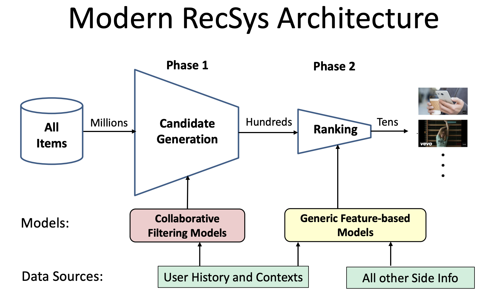

# DeepRec

DeepRec is an easy-to-use, end-to-end and scalable toolkit of deep-learning and reinforcement learning based recommender system models (e.g. Click Through Rate) which can be used for building your own custom recommender system efficiently and easily.

Note: This package is based on **TensorFlow(1.12.0)**, using tensorflow high level API Dataset and Estimator for constructing input function and model function, and using tensorflow-serving for serving the model.

## Architecture

* **Retrieval Strategy**
  * Collaborative filtering
  * Embedding (e.g. word2vec)
  * Semantic matching
* **Ranking Strategy**
  * Click through rate models
* **Exploration & Exploitation**
  * Reinforcement learning models

## Model list

### CTR Models

|     Model     | Conference | Paper                                                        | Contain |
| :-----------: | :--------: | ------------------------------------------------------------ | :-----: |
| LR (Baseline) |            | [An Introduction to Logistic Regression Analysis and Reporting](https://datajobs.com/data-science-repo/Logistic-Regression-[Peng-et-al].pdf) |    ✖    |
|      FM       |  ICDM'10   | [Factorization Machines](https://www.csie.ntu.edu.tw/~b97053/paper/Rendle2010FM.pdf) |    ✖   |
|      FFM      | RecSys'16  | [Field-aware Factorization Machines for CTR Prediction](https://www.csie.ntu.edu.tw/~cjlin/papers/ffm.pdf) **[Criteo]** |    ✔    |
|  Wide & Deep  |  DLRS'16   | [Wide & Deep Learning for Recommender Systems](https://arxiv.org/pdf/1606.07792.pdf) **[Google]** |    ✖    |
|      FNN      |  ECIR'16   | [Deep Learning over Multi-field Categorical Data: A Case Study on User Response Prediction](https://arxiv.org/abs/1601.02376) **[RayCloud]** |    ✖    |
|      PNN      |  ICDM'16   | [Product-based Neural Networks for User Response Prediction](https://arxiv.org/pdf/1611.00144.pdf) |    ✖    |
|    DeepFM     |  IJCAI'17  | [DeepFM: A Factorization-Machine based Neural Network for CTR Prediction](https://www.ijcai.org/proceedings/2017/0239.pdf) **[Huawei]** |    ✔    |
|      AFM      |  IJCAI'17  | [Attentional Factorization Machines: Learning the Weight of Feature Interactions via Attention Networks](https://www.ijcai.org/proceedings/2017/0435.pdf) |    ✖    |
|      NFM      |  SIGIR'17  | [Neural Factorization Machines for Sparse Predictive Analytics](https://arxiv.org/pdf/1708.05027.pdf) |    ✖    |
|      DCN      |   KDD'17   | [Deep & Cross Network for Ad Click Predictions](https://arxiv.org/pdf/1708.05123.pdf) |    ✖    |
|      DIN      |   KDD'18   | [Deep Interest Network for Click-Through Rate Prediction](https://arxiv.org/pdf/1706.06978.pdf) **[Alibaba]** |    ✔    |
|    AutoInt    |  arxiv'18  | [AutoInt: Automatic Feature Interaction Learning via Self-Attentive Neural Networks](https://arxiv.org/pdf/1810.11921.pdf) |    ✖    |
|     FNFM      |  arxiv'19  | [Field-aware Neural Factorization Machine for Click-Through Rate Prediction](https://arxiv.org/pdf/1902.09096.pdf) |    ✖    |

## Author

* Tong Jia – cecilio.jia@gmail.com – [https://github.com/Cecilio-Jia](https://github.com/Cecilio-Jia)